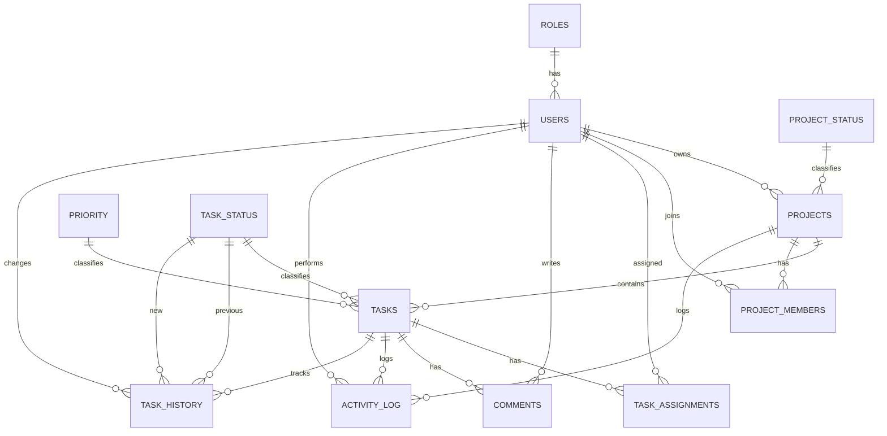

# 06. ERD and Database

## Database Overview

The database is designed around projects, tasks, users, roles, comments, and audit tables. It follows a normalized relational structure suitable for PostgreSQL.

## Entity Relationship Diagram

## Tables

### Roles

- role_id
- role_name

### Users

- user_id
- first_name
- last_name
- email
- password_hash
- role_id
- is_active
- created_at

### Project_Status

- project_status_id
- status_name

### Projects

- project_id
- project_name
- description
- start_date
- end_date
- project_status_id
- owner_id
- created_at

### Priority

- priority_id
- priority_name

### Task_Status

- status_id
- status_name

### Tasks

- task_id
- project_id
- created_by
- title
- description
- priority_id
- status_id
- due_date
- created_at
- updated_at

### Project_Members

- project_member_id
- project_id
- user_id
- joined_at

### Task_Assignments

- assignment_id
- task_id
- user_id
- assigned_at

### Comments

- comment_id
- task_id
- user_id
- comment
- created_at
- updated_at

### Activity_Log

- activity_id
- user_id
- task_id
- project_id
- action
- created_at

### Task_History

- history_id
- task_id
- changed_by
- previous_status_id
- new_status_id
- changed_at

## Key Relationships

- One role can belong to many users.
- One user belongs to exactly one role.
- One project has one owner.
- One project contains many tasks.
- One task can have many assignees.
- One engineer can be assigned to many tasks.
- One task can have many comments.
- Every task status change must create a task history record.
- Important actions must create an activity log entry.

## Constraints

- Email must be unique.
- Every user must reference a valid role.
- Every project must have a valid owner.
- Task due dates cannot be in the past.
- Project end date must be later than project start date.

## Design Notes

- Lookup tables such as roles, priorities, and statuses keep business values consistent.
- Join tables support many-to-many relationships without duplicating data.
- Audit tables preserve traceability for management and troubleshooting.
